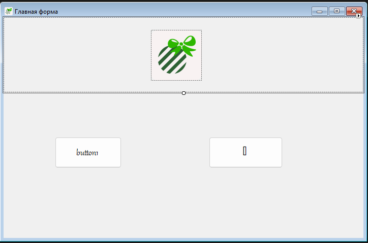
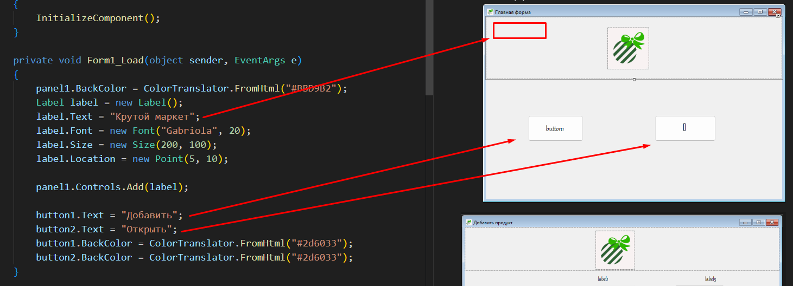
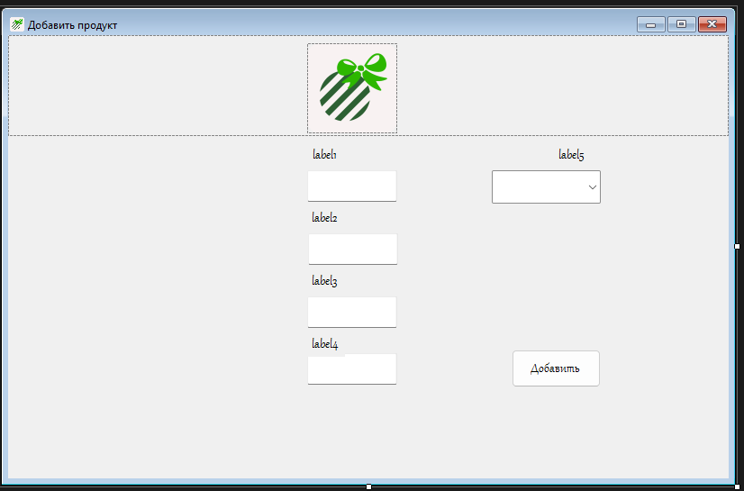
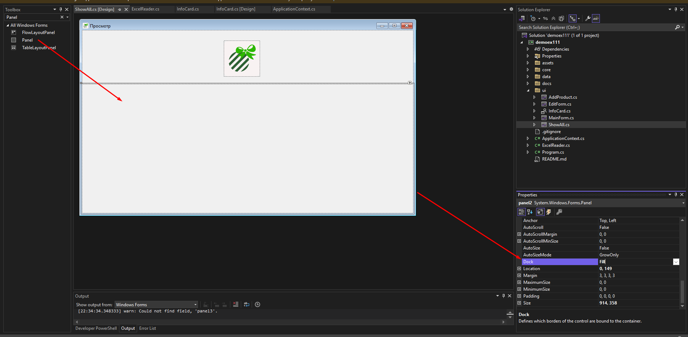
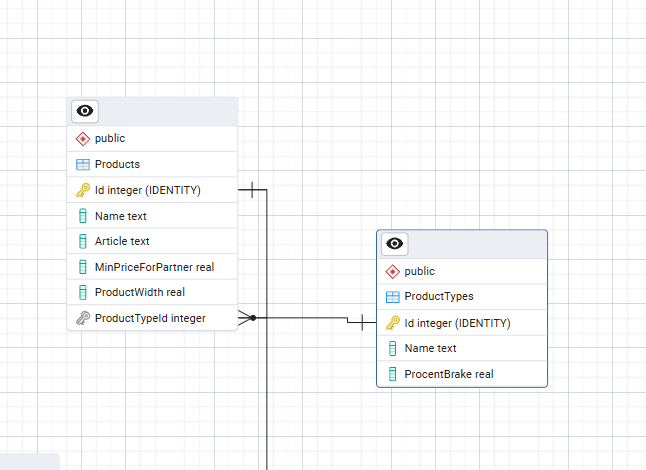

# 🏎️ Старт (Модуль 1)
Нам надо скачать зависимости перед тем, как работать в проекте.

## 🔭 Структура
```
.
└── demo (папка проекта/корень)
    └── ui (тут можно разместить все формы)
    │   └── Главная форма
    │   └── Форма добавления
    │   └── Карточка для представления продукта
    │   └── Форма показа всех продукта
    │   └── Форма редактирования
    ├── core
    │   └── ... (Рассмотрю ниже)
    ├── data
    │   └── Все Excel таблички
    ├── assets
    │    └── Иконки проекта
    └── ApplicationContext.cs
    └── ExcelReader.cs
    └── Program.cs
```

## 🦧 Модели (core)
Здесь надо просто зайти в одну из Excel таблиц и переписать все столбцы в наш класс.<br>
Для примера возьму таблицу `Materials_import.xlsx`

Ну и после просто создаем наш класс в папке `core/Material.cs` и делаем его публичным

### Ну соответсвенно
`Name` = `Наименование материала`
`MaterialTypeId` = `Тип Материала`
и т.д. <br>
Также у нас Entity Framework позволяет виртуально создавать объекты по ID. Вот например `materialType` связан по `MaterialTypeId` и мы можем пользоваться всеми его полями как захотим. 
### Визуально это выглядит так


## 😶‍🌫️ ApplicationContext
``` c#
namespace demo1
{
    internal class ApplicationContext : DbContext
    {
        public DbSet<Product> Products { get; set; }
        public DbSet<MaterialType> MaterialTypes { get; set; }
        public DbSet<ProductType> ProductTypes { get; set; }
        public DbSet<Material> Materials { get; set; }
        public DbSet<ProductMaterial> ProductMaterials { get; set; }
        public ApplicationContext() {
            Database.EnsureCreated();
        }

        protected override void OnConfiguring(DbContextOptionsBuilder optionsBuilder)
        {
            optionsBuilder.UseNpgsql("Host=localhost;Port=5432;Database=postgres;Username=postgres;Password=123");
        }
    }
}
```

- `DbSet<T>` создает сеты моделей для всех объектов 
- Конструктор создает БД `Database.EnsureCreated();`
            
- Подключаемся к бд `optionsBuilder.UseNpgsql("Host=localhost;Port=5432;Database=postgres;Username=postgres;Password=123");`

## 📖 Создадим класс для чтения Excel таблиц
Расмотрим один пример с чтением `Material_type_import.xlsx`
``` c#
public class ExcelReader
{
    public void ReadMaterialTypeFromExcelFile(ApplicationContext db, string excelFile)
    {
        ExcelPackage.License.SetNonCommercialPersonal("sadasdfasdgdrafhbrtshrthbtfghfgcgf"); // тут просто чтобы читать задаем, что мы не коммерческая орга
        using var package = new ExcelPackage(new FileInfo(excelFile)); // читаем наш файл
        var worksheet = package.Workbook.Worksheets[0]; // открываем первый лист
        for (int row = 2; row <= worksheet.Dimension.End.Row; row++) // проходимся по каждой строчке
        {
            var name = worksheet.Cells[row, 1].Text;
            var breakPercent = worksheet.Cells[row, 2].Text;

            MaterialType sample = new MaterialType { 
                Name = name, 
                PercentBreak = float.Parse(breakPercent.Replace("%", "")) 
            };

            db.MaterialTypes.Add(sample);
            db.SaveChanges();   
            // добавляем и сохраняем данные в бд
        }
    }
}
```
Остальные методы можно посмотреть в [репозитории](https://github.com/l1rn/demo1/blob/main/ExcelReader.cs)
я
# 👁️ Интерфейс (Модуль 2)
#### 1. Создаем карточку из объекта UserControl

#### 2. Настраиваем по заданию

#### 3. Для удобства создаем [DAO](https://ru.wikipedia.org/wiki/Data_Access_Object) объект в `core/ProductCardData.cs`, чтобы передавать его в эту "карточку"

``` c#
namespace demo1.core
{
    public class ProductCardData
    {
        public int ProductId { get; set; }
        public string? Type { get; set; }
        public string? ProductName { get; set; }
        public string? Article { get; set; }
        public double MinPriceForPartner { get; set; }
        public double Width { get; set; }
        public double Price { get; set; }
        public virtual Product? product { get; set; }
        public virtual Material? material { get; set; }
    }
}
```
<b>Так вот почему именно такой?</b> На картинке стрелками показано, где и как размещается. Ее применение будет [снизу](#тот-самый-payload)

Также прикрепил `Product` и `Material` для удобства в дальнейшем.

#### Настройка карточки
1. Для начала создадим функцию для работы с интерфейсом
``` c#
// Закоменченные переменные расмотрим позже
public partial class InfoCard : UserControl
{
    // private string _productName;
    // private Material _material { get; set; }

    public InfoCard(ProductLoadData productLoadData)
    {
        InitializeComponent();
        LoadCards(productLoadData);
    }
    private void LoadCards(ProductLoadData data) 
    {
        
    }
}
``` 
2. В целом для каждого лейбла задаем `ProductLoadData`
```c#
private void LoadCards(ProductLoadData data)
{
    this.BackColor = ColorTranslator.FromHtml("#BBD9B2");// Цвет для задания +2 балла
    label1.Text = data.ProductTypeName;
    label6.Text = data.ProductName;
    label2.Text = data.Article;
    label3.Text = $"{data.MinPricePartner:0.00} р."; // Форматируем
    label4.Text = $"{data.Width:0.00} м.";
    label7.Text = $"{data.Price:0.00} р.";


    // Сокращаем размер, потому что названия огромные и надо сократить
    label1.AutoEllipsis = true; 
    label6.AutoEllipsis = true;
    label1.MaximumSize = new Size(200, 20);
    label6.MaximumSize = new Size(200, 20);

    // _productName = data.ProductName;
    // _material = data.material;
}
```

# 😮‍💨 Опять исключения и интерфейсы другими словами (3 модуль)
## Создаем окошки
### 1. Главная форма 

- Я задал текст элементам через код
    

### 2. Делаем форму добавления и редактирования одной формой, потом просто поменяем логику кнопок


### 3. Форма просмотра
Делаем такую же как и [Главная форма](#1-главная-форма), только вместо кнопок у нас будет `Panel` с параметром `Dock.Fill`

#### Настраиваем нашу форму внутри
1. Создаем новый метод `private void LoadCards()` и пихаем его в конструктор
``` c#
public ShowAll()
{
    InitializeComponent();
    LoadCards();
}
```
2. Внутри этого метода делаем логику для наших карточек, как они должны подгружаться на этой форме.

``` c#
// !!! Закоментированный код, пока не рассматриваем, так как это расчет цены для продукта. !!!

try
{
    using (ApplicationContext db = new ApplicationContext())
    {
        panel2.Controls.Clear();
        int y = 10;
        int space = 10;

        // var productMaterials = db.ProductsMaterial
        //     .Include(pm => pm.material)
        //     .ToList();

        var productTypes = db.ProductTypes.ToDictionary(pt => pt.Id, pt => pt.Name); 

        // Иттерируемся по каждому продукту в бд по таблице Products
        foreach (var product in db.Products.ToList()) {
            // float price = 0;
            // var productToMaterials = productMaterials
            //     .Where(pm => pm.ProductId == product.Id)
            //     .ToList();

            // Material material = new Material();
            // foreach(var productMaterial in productToMaterials)
            // {
            //     price += productMaterial.material.PriceForOneUnit * productMaterial.NeedToProduct;
            //     material = productMaterial.material;
            // }

            if(!productTypes.TryGetValue(product.ProductTypeId, out string productTypeName))
            {
                return;
            }

            ProductLoadData data = new ProductLoadData { 
                ProductTypeName = productTypeName,
                ProductName = product.Name,
                Article = product.Article,
                MinPricePartner = product.MinimalPriceForPartner,
                Width = product.Width,
                Price = 0,
            };

            InfoCard infoCard = new InfoCard(data);
            infoCard.Location = new Point(10, y);
            infoCard.Width = panel2.Width - 40;

            panel2.Controls.Add(infoCard);
            panel2.AutoScroll = true;
            y += infoCard.Height + space;
        }
    }
}
```
#### Логика интерфейса для панели 
- `panel2.Controls.Clear();` - очищает панель каждый раз.
- `y` - будущая высота для карточки.
- `space` - расстояние между карточками.
#### Словарь для типа продуктов и как работают методы
- `productTypes` - типы продуктов в словаре **(id, product_type)**, ниже описываю суть работы.

    1. Мы сейчас находимся в жизненном цикле и можем манипулировать с бд как хотим, потому что я написал `using (ApplicationContext db = new ApplicationContext()) `.
    2. Так вот обращаемся к таблице, которая нам нужна `db.ProductTypes`.
    3. Ну и с помощью [LINQ](https://learn.microsoft.com/en-us/dotnet/api/system.linq.enumerable.todictionary?view=net-9.0) уже переношу в словарь, чтобы потом задействовать. `ToDictionary(pt => pt.Id, pt => pt.Name)`

- `if(!productTypes.TryGetValue(product.ProductTypeId, out string productTypeName))`
    1. Здесь я пытаюсь получить имя типа продукта из словаря, который мы создали до начала цикла и сравниваю `product.ProductTypeId`
    2. У нас связаны `Product` и `ProductType` и хочу получить имя, которое я оставил в словаре и получаю `out string productTypeName`.
    

#### Тот самый [payload](#3-для-удобства-создаем-dao-объект-в-coreproductcarddatacs-чтобы-передавать-его-в-эту-карточку)
``` c#
ProductLoadData data = new ProductLoadData { 
    ProductName = product.Name, 
    Article = product.Article,
    MinPricePartner = product.MinimalPriceForPartner,
    Width = product.Width,
    ProductTypeName = productTypeName, // мы полуили его с нашего словаря 
    Price = 0 // Расчет цены будет ниже
};
```

#### Создание уже самой [карточки](#настройка-карточки)
```c#
InfoCard infoCard = new InfoCard(data);
infoCard.Location = new Point(10, y);
infoCard.Width = panel2.Width - 40;
```
#### Добавление на панель
```c#
panel2.Controls.Add(infoCard); 
panel2.AutoScroll = true;
y += infoCard.Height + space; // Добавляем к нашей высоте, чтобы не получилась каша 
```

# 🎴 Создаем метод (4 модуль)
``` c#
using (ApplicationContext db = new ApplicationContext()) {
    var products = db.Products.ToDictionary(p => p.Name, p => p.Width); // создаем словарь на продукты
    var productTypes = db.ProductTypes.ToDictionary(pt => pt.Id, pt => pt.Name); // создаем словарь на тип продуктов

    if(!products.TryGetValue(_productName, out float pWidth))
    {
        MessageBox.Show("Не получилось найти продукт");
        return;
    }
    Product p = db.Products.Where(p => p.Name == _productName).FirstOrDefault();

    float p1 = float.Parse(textBox1.Text); // параметр 1 - сколько нужно продукта
    float p2 = pWidth; // параметр 2 - ширина продукта
    float p3 = db.ProductTypes.Find(p.ProductTypeId).TypeCoef; // тип коэффициента продукт, тип продукта

    float m1Divide = _material.QuantityInPackage; // сколько материала в упаковке
    float m2 = _material.QuantityInStorage; // надо высчитывать, сколько на складе есть высчитывать с минимальным количеством
    float m3 = db.MaterialTypes.Find(_material.MaterialTypeId).PercentBreak; // процент брака

    float first = p1 * p2 * p3 * m3;
    float result = first / m1Divide;
    MessageBox.Show($"Материала потребуется: {result:0.00}");
}
```
