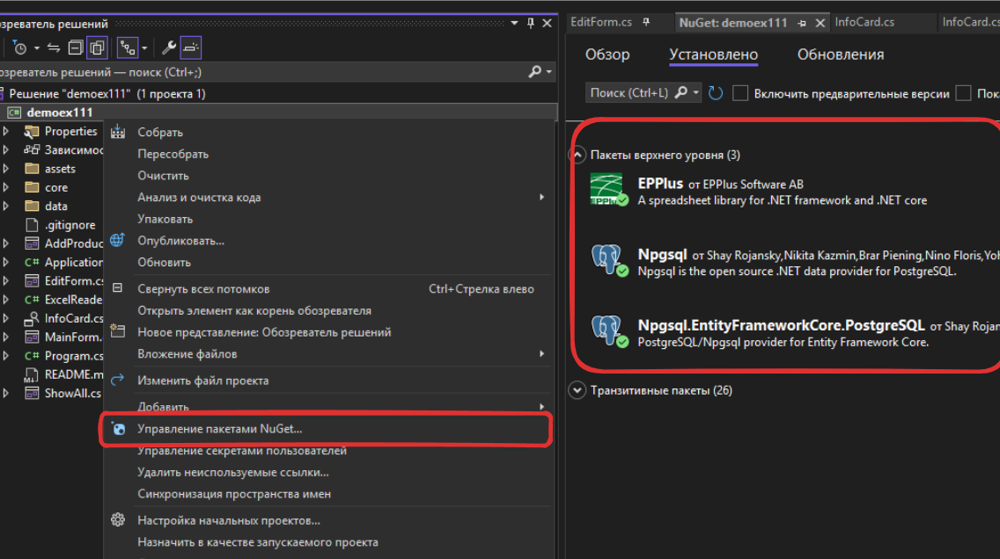
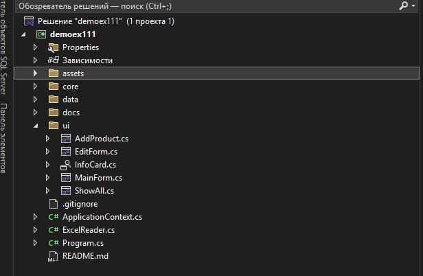
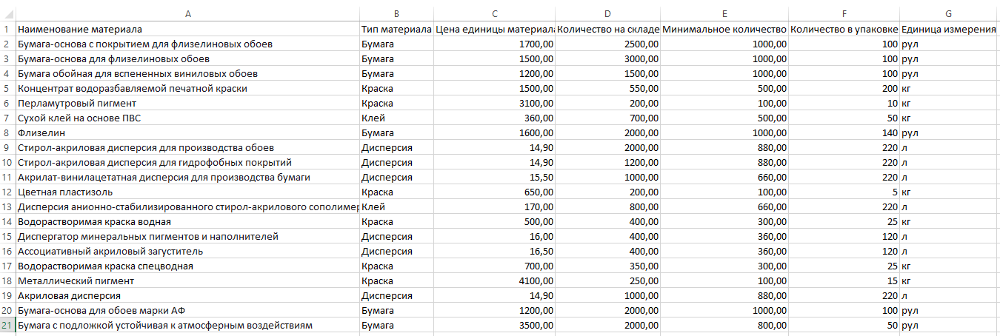
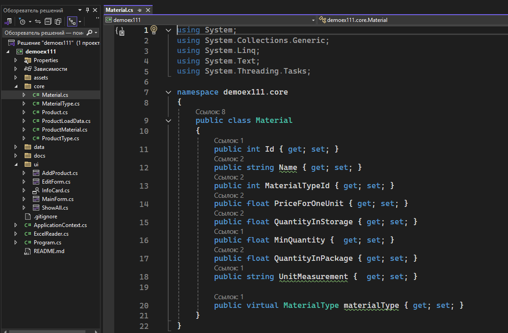
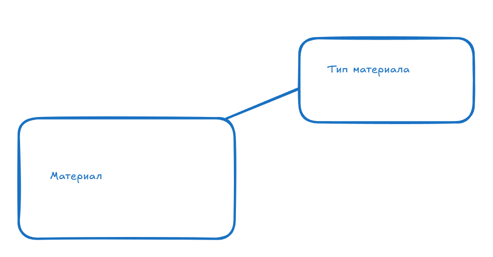
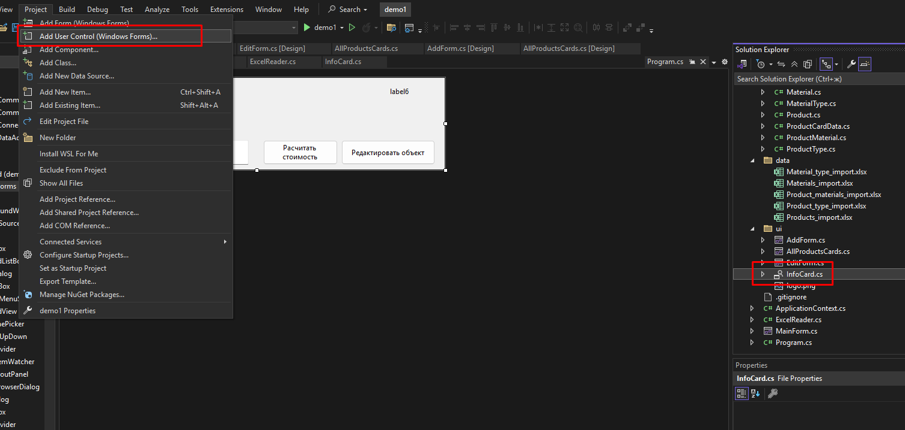
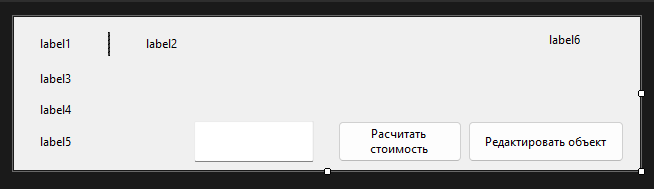
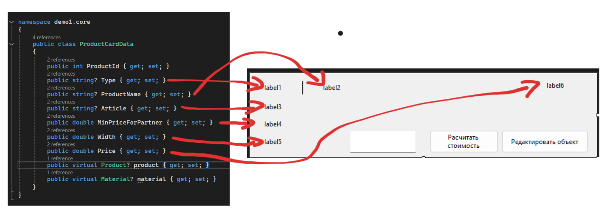

# 🏎️ Старт (Модуль 1)
Нам надо скачать зависимости перед тем, как работать в проекте.

## 🔭 Структура
```
.
└── demo (папка проекта/корень)
    └── ui (тут можно разместить все формы)
    │   └── Главная форма
    │   └── Форма добавления
    │   └── Карточка для представления продукта
    │   └── Форма показа всех продукта
    │   └── Форма редактирования
    ├── core
    │   └── ... (Рассмотрю ниже)
    ├── data
    │   └── Все Excel таблички
    ├── assets
    │    └── Иконки проекта
    └── ApplicationContext.cs
    └── ExcelReader.cs
    └── Program.cs
```

## 🦧 Модели (core)
Здесь надо просто зайти в одну из Excel таблиц и переписать все столбцы в наш класс.<br>
Для примера возьму таблицу `Materials_import.xlsx`

Ну и после просто создаем наш класс в папке `core/Material.cs` и делаем его публичным

### Ну соответсвенно
`Name` = `Наименование материала`
`MaterialTypeId` = `Тип Материала`
и т.д. <br>
Также у нас Entity Framework позволяет виртуально создавать объекты по ID. Вот например `materialType` связан по `MaterialTypeId` и мы можем пользоваться всеми его полями как захотим. 
### Визуально это выглядит так


## 😶‍🌫️ ApplicationContext
``` c#
namespace demo1
{
    internal class ApplicationContext : DbContext
    {
        public DbSet<Product> Products { get; set; }
        public DbSet<MaterialType> MaterialTypes { get; set; }
        public DbSet<ProductType> ProductTypes { get; set; }
        public DbSet<Material> Materials { get; set; }
        public DbSet<ProductMaterial> ProductMaterials { get; set; }
        public ApplicationContext() {
            Database.EnsureCreated();
        }

        protected override void OnConfiguring(DbContextOptionsBuilder optionsBuilder)
        {
            optionsBuilder.UseNpgsql("Host=localhost;Port=5432;Database=postgres;Username=postgres;Password=123");
        }
    }
}
```

- `DbSet<T>` создает сеты моделей для всех объектов 
- Конструктор создает БД `Database.EnsureCreated();`
            
- Подключаемся к бд `optionsBuilder.UseNpgsql("Host=localhost;Port=5432;Database=postgres;Username=postgres;Password=123");`

# 👁️ Интерфейс (Модуль 2)
#### 1. Создаем карточку из объекта UserControl

#### 2. Настраиваем по задание

#### 3. Для удобства создаем [DAO](https://ru.wikipedia.org/wiki/Data_Access_Object) объект в `core/ProductCardData.cs`, чтобы передавать его в эту "карточку"

``` c#
namespace demo1.core
{
    public class ProductCardData
    {
        public int ProductId { get; set; }
        public string? Type { get; set; }
        public string? ProductName { get; set; }
        public string? Article { get; set; }
        public double MinPriceForPartner { get; set; }
        public double Width { get; set; }
        public double Price { get; set; }
        public virtual Product? product { get; set; }
        public virtual Material? material { get; set; }
    }
}
```
<b>Так вот почему именно такой?</b> Абстрактно даем каждому полю в карточке свой параметр на картинке по понятнее

Также прикрепил `Product` и `Material` для удобства в дальнейшем